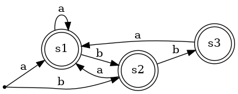
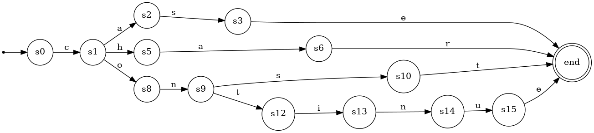

# Compiler construction 2021 - exam preparation

Author: Peter Jochum

## Lexical analysis (page 91)

### Exercise 2.1

Write regular expressions for the following character sets, or give reasons
why no expression can be written:

#### a. All strings of lowercase letters that begin and end in **a**

```text
a[a-z]*a|a
```

#### b. All strings of lowercase letters that either begin or end in a (or both)

```text
a[a-z]*|[a-z]*a
```

#### c. All strings of digits that contain no leading zeros

```text
[1-9][0-9]*
```

#### d. All strings of digits that represent even numbers

```text
^[0-9]*[0|2|4|6|8]
```

#### e. All strings of digits such that all the 2's occur before all the 9's

```text
[0-8]*[0|1|3-9]*
```

#### f. All strings of a's and b's that contain no three consecutive b's

```bash
#Solution 1 - Thanks to Selene
a*(b|bb)?(a+(b|bb)?)*

# Solution 2 - Thanks to Sebastian
(a* | (ba+) | (bba+))* (b|bb)?
```

DFA accepting the language:



#### g. All strings containing an odd number of a's and/or b's

```bash
b*ab*(b*ab*ab*)*$|a*ba*(a*ba*ba*)*
```

[g. Test on regex101](https://regex101.com/r/nkd6Xp/1)

#### h. All strings of a's and b's that contain an even number of a's and b's

```text
# Selene
(b*ab*ab*)*|(a*ba*ba*)*
```

#### i. All strings of a's and b's that contain exactly as many a's and b's

Not possible - would need an unlimited number of states to memorize count.

### Excercise 2.9

Construct a DFA accepting case, char, continue



## Context free grammars (page 138)

### Excercise 3.2

**Language**
A -> AA | (A) | $\epsilon$

#### a. Describe the generated language

Generates a set of matching braces

Regex (?R) is a recursion of the whole pattern - [Test on regex101](https://regex101.com/r/cAb5Z6/1)

```bash
\((?R)*\)

# Examples
(())()
()(((())))
()()()()
```

#### b. Show it is ambigous

Ambiguity shown by finding 2 leftmost or rightmost derivations for an input string:

**Input string:** ()

Leftmost derivation 1:

```text
A -> (A)
  -> ()
```

Leftmost derivation 2:

```text
A -> AA
  -> (A)A
  -> ()A
  -> ()
```

### Excercise 3.4

The following grammar generates all regular rexpressions over the alphabet of
letters. (vertical bar in "" is operator).

```text
rexp -> rexp "|" rexp
        | rexp rexp
        | rexp *
        | (rexp)
        | letter
```

#### a. Give a derivation for the regular expression (ab|b)* using this grammar

|      | Step               |
|------|--------------------|
| rexp | rexp*              |
|      | (rexp)*            |
|      | (rexp \| rexp)*    |
|      | (rexp rexp\|rexp)* |
|      | (a rexp\|rexp)*    |
|      | (ab\|rexp)*        |
|      | (ab\|b)*           |

#### b. Show that the grammar is ambigous

Input string: abc

Leftmost derivation 1:

|      | Step        |
|------|-------------|
| rexp | rexp rexp   |
|      | a rexp      |
|      | a rexp rexp |
|      | a b rexp    |
|      | a b c       |

Leftmost derivation 2:

|      | Step           |
|------|----------------|
| rexp | rexp rexp      |
|      | rexp rexp rexp |
|      | a rexp rexp    |
|      | a b rexp       |
|      | a b c          |

#### c. Rewrite this grammar to establish the correct precedences for the operators

```grammar
rexp -> rexp "|" C | C
C -> C F | F
F ->  L * | L
L -> (rexp) | letter
```

d. What associativity does your answer in c. give to the binary operators? Why?:

Left recursion -> left associativity

## Literature

- [Compiler construction principles, K.C. Louden](https://csunplugged.files.wordpress.com/2012/12/compiler-construction-principles-and-practice-k-c-louden-pws-1997-cmp-2002-592s.pdf)
- [Regex examples and solutions](https://www.cs.cmu.edu/~iliano/courses/09S-CMU-CS212/classwork/recitations/rec21/rec21-sol.pdf)
